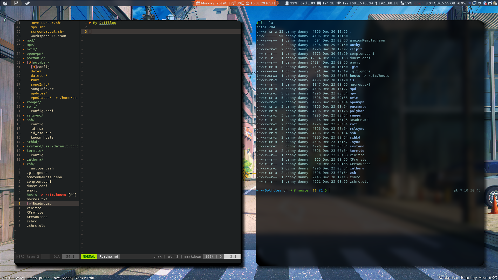

# My Dotfiles

# Using

(in no particular order)

- i3
- polybar
- compton
- sxhkd
- kitty
- zsh
- antigen.zsh (`curl -L git.io/antigen > antigen.zsh`)
- dunst
- neovim
- ranger
- zathura
- mpv
- mpd
- rofi
- clipit

# Installation
TODO
